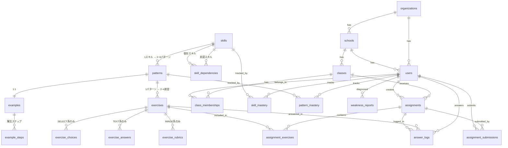

# 数学学習サービス DBスキーマ設計書

## ER図（Mermaid）



## テーブル一覧

| # | カテゴリ | テーブル名 | 概要 | 主な関係 |
|---|---------|-----------|------|---------|
| 1 | コア | `skills` | スキル（103個） | → patterns, skill_dependencies |
| 2 | コア | `skill_dependencies` | スキル依存（47本） | skills ↔ skills |
| 3 | コア | `patterns` | 型（2~6/スキル） | → examples, exercises |
| 4 | コア | `examples` | 例題（1/パターン） | → example_steps |
| 5 | コア | `example_steps` | 解法ステップ | ← examples |
| 6 | コア | `exercises` | 演習問題（2~4/パターン） | → choices, answers, rubrics |
| 7 | コア | `exercise_choices` | 選択肢（SELECT系） | ← exercises |
| 8 | コア | `exercise_answers` | 正解パターン（TEXT系） | ← exercises |
| 9 | コア | `exercise_rubrics` | 採点ルーブリック（IMAGE系） | ← exercises |
| 10 | B2B | `organizations` | 組織 | → schools, users |
| 11 | B2B | `schools` | 学校 | → classes, users |
| 12 | B2B | `users` | ユーザー（統合） | → class_memberships |
| 13 | B2B | `classes` | クラス | → class_memberships, assignments |
| 14 | B2B | `class_memberships` | クラス所属 | users ↔ classes |
| 15 | 履歴 | `answer_logs` | 回答ログ | users × exercises |
| 16 | 履歴 | `skill_mastery` | スキル習熟度 | users × skills |
| 17 | 履歴 | `pattern_mastery` | パターン習熟度 | users × patterns |
| 18 | 履歴 | `weakness_reports` | 弱点診断ログ | ← users |
| 19 | 宿題 | `assignments` | 宿題 | classes × users(教師) |
| 20 | 宿題 | `assignment_exercises` | 宿題の問題 | assignments × exercises |
| 21 | 宿題 | `assignment_submissions` | 提出状況 | assignments × users(生徒) |

## 設計判断

### 1. 入力テンプレート別データの分離戦略

```
exercises（共通）
├── exercise_choices    → SELECT_BASIC / SELECT_MULTI のみ
├── exercise_answers    → TEXT_NUMERIC / TEXT_EXPRESSION / TEXT_SET のみ
└── exercise_rubrics    → IMAGE_PROCESS / IMAGE_PROOF のみ
```

**理由**: 7つのテンプレートを1テーブルに押し込むとNULLだらけになる。
テンプレート種別ごとに子テーブルを分けることで：
- スキーマレベルで型安全
- クエリが素直（JOINで必要なものだけ取得）
- 将来テンプレート追加時も既存テーブル変更不要

### 2. ユーザーテーブルの統合

教師・生徒・管理者を `users` テーブルに統合し、`user_role` ENUMで区別。

**理由**:
- `answer_logs` や `assignments` のFK管理がシンプル
- 将来「教師が自分で問題を解く」等の機能追加が容易
- RLSポリシーで権限制御可能

### 3. 習熟度の2階層キャッシュ

```
answer_logs（生データ）
  ↓ 集計
skill_mastery（スキルレベル）  ← ダッシュボード表示用
pattern_mastery（パターンレベル） ← 弱点診断の精緻化用
```

**更新タイミング**: 回答ごとにUPSERT（INSERT ON CONFLICT UPDATE）

### 4. mastery_level の判定基準（案）

| レベル | 条件 |
|--------|------|
| `not_started` | attempts = 0 |
| `struggling` | accuracy < 0.4 かつ attempts ≥ 3 |
| `developing` | 0.4 ≤ accuracy < 0.8 |
| `proficient` | accuracy ≥ 0.8 かつ streak ≥ 3 |
| `mastered` | accuracy ≥ 0.9 かつ streak ≥ 5 かつ attempts ≥ 10 |

### 5. コスト追跡

`answer_logs.grading_cost` に採点1回あたりの実コストを記録。
`v_monthly_grading_cost` ビューで組織×月×手法別に集計し、
課金・予算管理に使用。

## データ量の見積もり

| テーブル | 1年目想定レコード数 | 備考 |
|---------|-------------------|------|
| `skills` | 103 | 固定マスタ |
| `patterns` | ~400 | 103 × 平均4パターン |
| `exercises` | ~1,200 | 400 × 平均3問 |
| `users` | ~5,000 | 10校 × 500人 |
| `answer_logs` | ~2,000,000 | 5000人 × 400回答/年 |
| `skill_mastery` | ~500,000 | 5000人 × 103スキル |

→ answer_logs のパーティショニングは2年目以降で検討（月別）

## 次のステップ

1. **サンプルデータ投入**: 「整式の加法・減法」の3パターン分を実データで投入
2. **マイグレーション**: IndexedDB → PostgreSQL への移行スクリプト
3. **API設計**: 各テーブルに対するCRUDエンドポイント
4. **RLSポリシー**: 組織・学校・クラス単位のアクセス制御
5. **バッチ処理**: skill_mastery / pattern_mastery の再計算ジョブ
